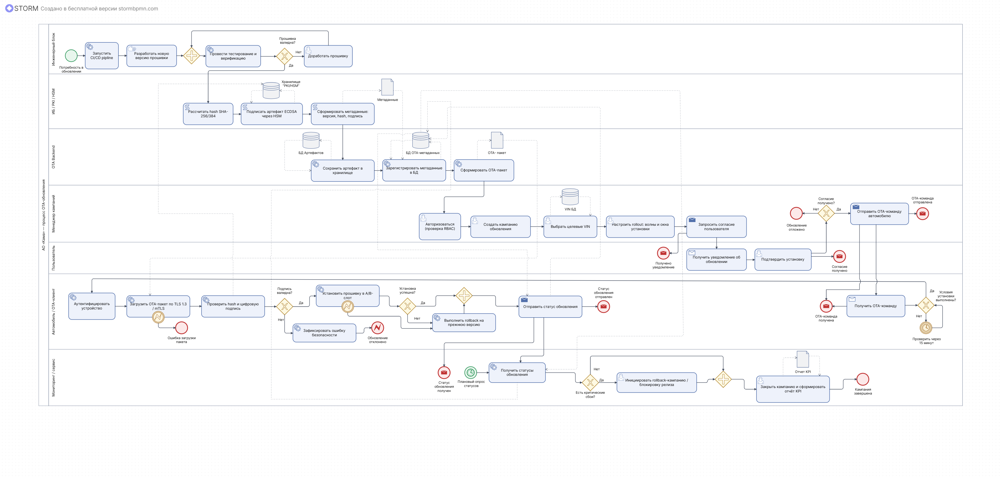

# BPMN-диаграмма процесса TO-BE: Внедрение ОТА-системы

## Описание артефакта
BPMN-диаграмма в нотации **BPMN 2.0**, описывающая целевой процесс **(TO-BE)** полного жизненного цикла обновления бортового ПО электромобиля "Атом" — от сборки прошивки до установки на автомобиль и обработки сбоев.

## Контекст
Проект выполнен для АО "Кама" в рамках дипломной работы в РЭУ им. Г.В. Плеханова. 
На момент анализа обновления выполнялись в ручном режиме через дилерские центры (занимало до 4 часов). 

**Задача:** спроектировать полностью автоматизированный процесс доставки прошивок "по воздуху" (Over-The-Air) с контролем безопасности и возможностью отката.

## Что отражено на диаграмме

**1. Зона ответственности инженеров (левая часть):**
- Запуск CI/CD pipeline для сборки новой прошивки
- Тестирование и верификация
- Проверка качества (если не ОК → возврат на доработку)

**2. Криптографическая подпись (PKI/HSM):**
- Подписание артефакта через аппаратный модуль (ECDSA)
- Формирование метаданных: версия, хеш-сумма, цифровая подпись
- Загрузка подписанного пакета в хранилище артефактов

**3. Формирование ОТА-кампании (BPMN-пул):**
- Авторизация через RBAC
- Создание кампании обновления
- Выбор целевых автомобилей (VIN-реестр)
- Настройка rollout-стратегии: волны и временные окна
- Запрос согласия пользователя

**4. Доставка и установка на автомобиль:**
- Автоматическое уведомление устройства о новом обновлении
- Загрузка пакета по защищенному каналу (TLS 1.3 / mTLS)
- Проверка хеша и цифровой подписи (валидация)
- Установка прошивки в A/B-слот (безопасное обновление с возможностью отката)

**5. Обработка ошибок и rollback (нижняя часть):**
- Ошибка загрузки → фиксация инцидента
- Ошибка верификации подписи → блокировка обновления
- Критические сбои после установки → инициация rollback-кампании
- Автоматический откат на предыдущую стабильную версию

## Файл

## Ценность для бизнеса
- Полная автоматизация: от сборки до установки, без участия дилера
- Время обновления снижено с 4 часов до ~15 минут
- Защита от ошибок: двухступенчатая проверка (хеш + цифровая подпись) и A/B-слот
- Управляемость: rollout по волнам снижает риски для всего парка авто
- Безопасность: возможность мгновенного отката (rollback) при критических сбоях
