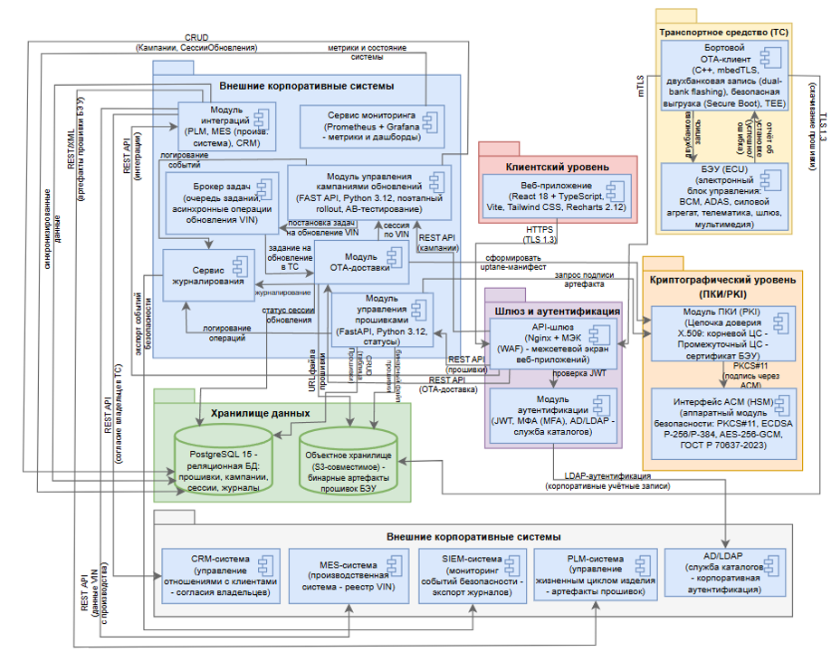

# UML-диаграмма компонентов: Архитектура ОТА-системы

## Описание артефакта
UML-диаграмма компонентов в нотации **UML**, описывающая высокоуровневую архитектуру OTA-системы для электромобиля "Атом", включая внешние интеграции, криптографическую защиту и клиентский интерфейс.

## Контекст
Разработана для дипломной работы в РЭУ им. Г.В. Плеханова на основе реальных требований АО "Кама". 
Задача — спроектировать масштабируемое решение для доставки прошивок, соответствующее стандартам информационной безопасности и интеграционным требованиям корпоративного ландшафта.

## Что отражено на диаграмме

**1. Клиентский уровень (Frontend):**
- Веб-приложение на **React 18 + TypeScript** (Vite, Tailwind, Recharts)
- Взаимодействие через **HTTPS (TLS 1.3)**
- Формирование и отправка запросов на обновление (играе-маніфест)

**2. Интеграционный шлюз (API Gateway):**
- **Nginx + WAF** (межсетевой экран)
- Аутентификация через **JWT** и корпоративный **LDAP/AD**
- Поддержка **MFA (многофакторной аутентификации)**

**3. Криптографический уровень (ПКИ/РКИ):**
- Инфраструктура открытых ключей на базе **X.509**
- Аппаратный модуль безопасности (**HSM**) через интерфейс **PKCS#11**
- Поддержка криптоалгоритмов: **ECDSA P-256/P-384, AES-256-GCM, ГОСТ Р**

**4. Бэкенд-ядро и бизнес-логика (Core):**
- **CRUD**-операции над сущностями (кампании, сессии обновлений)
- **Модуль интеграции** с внешними корпоративными системами (**PLM, MES, CRM**)
- **Брокер задач** для асинхронной обработки операций обновления VIN
- **Сервис журнализации** и обработки телеметрии

**5. Хранилища данных (Data Layer):**
- **PostgreSQL 15** — реляционная БД для хранения кампаний, сессий, VIN-реестра
- **S3-совместимое хранилище** — для бинарных артефактов прошивок (бортовых устройств)

**6. Внешние корпоративные системы:**
- **PLM** — управление жизненным циклом прошивок
- **MES** — производственный реестр VIN-номеров
- **CRM** — управление клиентскими запросами
- **SIEM** — мониторинг и сбор логов безопасности
- **AD/LDAP** — служба каталогов для унифицированной аутентификации

## Файл

## Ценность для бизнеса
- Даёт полное представление об IT-ландшафте проекта для архитекторов и разработчиков
- Служит основой для разбивки работ на компоненты и микросервисы
- Демонстрирует соблюдение требований кибербезопасности (криптография, HSM, SIEM)
- Упрощает планирование интеграций с существующими корпоративными системами заказчика
