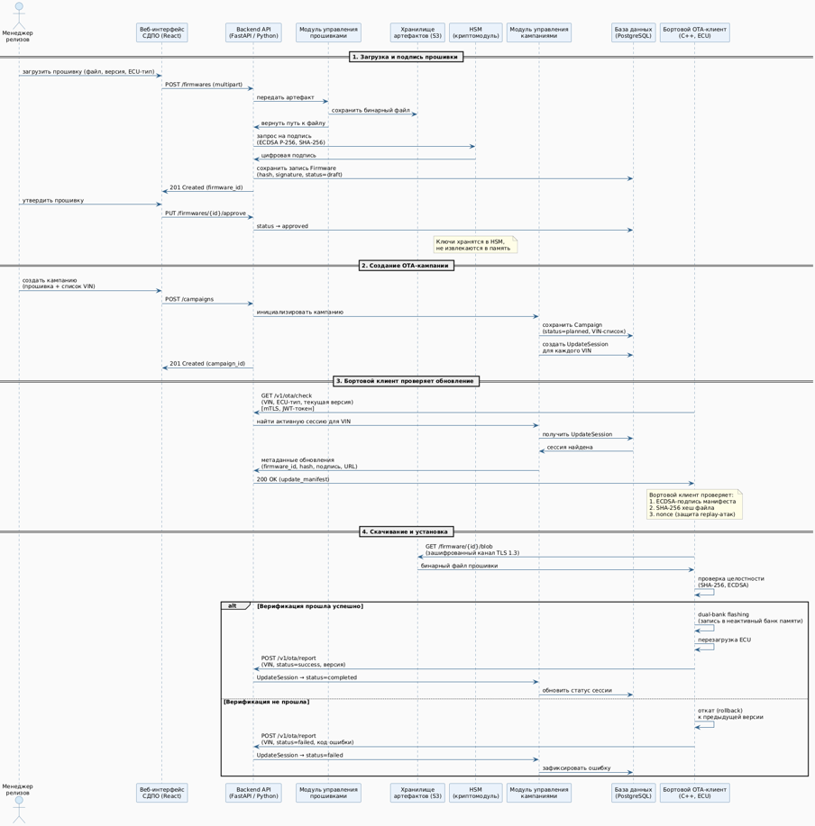

# UML-диаграмма последовательности: Загрузка прошивки на автомобиль

## Описание артефакта
UML-диаграмма последовательности в нотации **UML**, описывающая полный цикл взаимодействия между компонентами OTA-системы: от загрузки прошивки инженером до установки на бортовой компьютер автомобиля и обработки статусов.

## Контекст
Разработана для дипломной работы в РЭУ им. Г.В. Плеханова на основе реальной логики проекта "Атом".
Задача — детализировать временну́ю последовательность обмена сообщениями между сервисами (REST API, асинхронные задачи) на всех этапах: загрузка, подпись, создание кампании, доставка и верификация.

## Что отражено на диаграмме

Диаграмма разделена на **4 ключевых сценария**, каждый из которых показывает свой поток интеграций:

### Загрузка и подпись прошивки (этап инженера)
- Загрузка бинарного файла через `POST /firmwares (multipart)`
- Передача артефакта в HSM для подписания (**ECDSA-P256, SHA-256**)
- Сохранение метаданных (hash, подпись) в БД со статусом `draft`
- Утверждение прошивки через `PUT /firmwares/{id}/approve` (статус → `approved`)

> **Важно:** ключи хранятся в аппаратном модуле (HSM) и не извлекаются в память.

### Создание ОТА-кампании (этап планирования)
- Создание кампании через `POST /campaigns` (прошивка + список VIN)
- Генерация `UpdateSession` для каждого автомобиля в кампании
- Статус кампании: `planned`

### Бортовой клиент проверяет обновление
- Автомобиль опрашивает облако через `GET /v1/ota/check (mTLS, JWT)`
- Передаются: VIN, тип ECU, текущая версия ПО
- Система находит активную сессию и возвращает **манифест обновления**:
  - `firmware_id`
  - хеш-сумма (SHA-256)
  - цифровая подпись (ECDSA)
  - URL для скачивания

### Скачивание, установка и обратная связь
- Автомобиль скачивает прошивку по **TLS 1.3** (`GET /firmware/{id}/to`)
- Проверяет целостность (хеш + ECDSA-верификация)
- Отправляет отчёт в облако через `POST /v1/ota/report`:

| Сценарий | Действие | Статус сессии |
|:---|:---|:---|
| ✅ Верификация успешна | Установка завершена | `completed` |
| ❌ Верификация не пройдена | Отправка кода ошибки | `failed` |

## Файл

## Ценность для бизнеса
- Даёт разработчикам **готовую спецификацию для реализации API** (контракты, методы, статусы)
- Позволяет тестировщикам подготовить **сценарии позитивных и негативных проверок**
- Демонстрирует **сквозной поток данных**: от инженера до автовладельца
- Показывает реализацию **криптографической защиты на каждом этапе** (HSM, TLS, ECDSA)
- Фиксирует **обработку ошибок** на уровне интеграций
