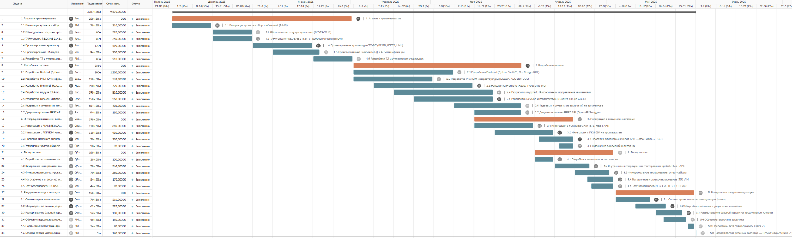

# Диаграмма Ганта: План внедрения ОТА-системы

## Описание артефакта
Комплексный план-график проекта (диаграмма Ганта), включающий полную декомпозицию работ, временные оценки и расчет бюджета внедрения OTA-системы в АО "Кама" (проект электромобиля "Атом").

## Контекст
Разработана для дипломной работы в РЭУ им. Г.В. Плеханова на основе реальных данных и ограничений проекта "Атом".
**Задача:** подготовить реалистичный план внедрения, который можно использовать для:
- Согласования сроков с руководством
- Выделения бюджета (CAPEX/OPEX)
- Мониторинга прогресса и контроля отклонений

## Что отражено на диаграмме

**1. Этапы проекта:**
- Анализ и сбор требований
- Проектирование архитектуры (BPMN, UML, API-контракты)
- Разработка и интеграция компонентов
- Тестирование (Unit, интеграционное, приемочное)
- Пилотное внедрение (на ограниченном пуле VIN)
- Масштабирование на весь парк автомобилей

**2. Управленческие артефакты:**
- Ключевые вехи (Milestones) — точки принятия решений (Gate-контроль)
- Критические зависимости между задачами
- Назначение ответственных ролей (инженеры, аналитики, тестировщики)

**3. Финансовая модель:**
- **CAPEX:** оборудование, лицензии, HSM-модули, S3-хранилище
- **OPEX:** эксплуатационные расходы, поддержка, обновления

## Файл

## Ценность для бизнеса
- Дает прозрачную картину сроков и бюджета для всех стейкхолдеров
- Позволяет выявить критические риски на этапе планирования
- Является основой для еженедельного мониторинга статуса проекта
- Показывает зрелый подход к управлению проектами со стороны аналитика
